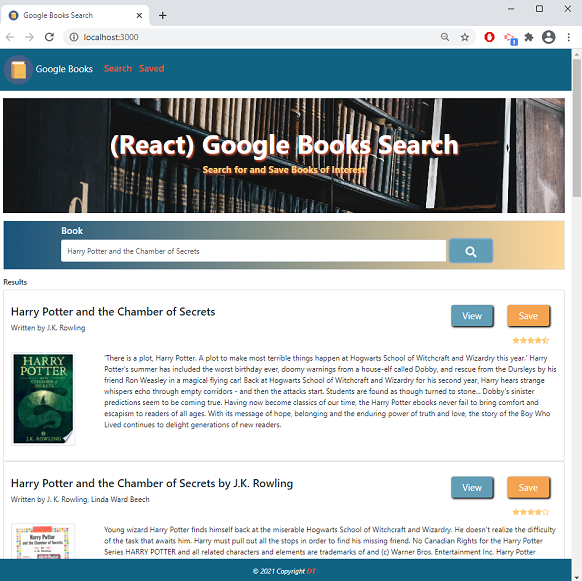
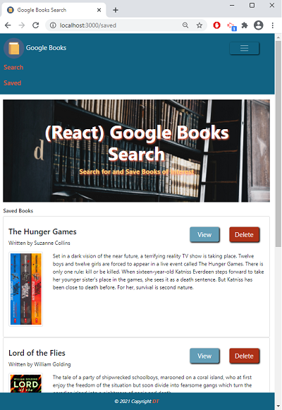

# 21-Google_Books_Search  
---  

<span align="center">  


 <a href="https://img.shields.io/badge/react-v17.0.1-green?style=plastic"></a>
<a href="https://img.shields.io/badge/axios-v0.21.1-blue?style=plastic"></a>
 <a href="https://img.shields.io/badge/express-v4.16.4-orange?style=plastic"></a>
<a href="https://img.shields.io/badge/DB-MongoDB-yellow?style=plastic"></a>
<a href="https://img.shields.io/badge/npm-Mongoose-red?style=plastic"></a>
 <a href="https://img.shields.io/badge/License-MIT-brightgreen?style=plastic"></a>  
 
 </span>

---

## Table of Contents  
* [Description](#Description)
* [User Story and Details](#User-Story-and-Details)  
* [Installation and Usage](#Installation-and-Usage)  
* [Images of the app](#Images-of-the-app-)  
* [License](#License)  
* [Contact](#Contact) 


## Description  
This application allows you to search quickly in Google Books for books and saved books of interest with all their details. It uses [Google Books API](https://developers.google.com/books/docs/v1/getting_started) to search and view books. The application uses [React](https://reactjs.org/), [axios](https://www.npmjs.com/package/axios), [MongoDB with Mongoose](https://mongoosejs.com/docs/) and [Boothstrap](https://getbootstrap.com/docs/4.6/getting-started/introduction/).  


## User Story and Details  

```
User Story Acceptance Criteria
```
```
As a user,  
I want to be able to search Google Books API and list all the books.  
WHEN I like a book,  
I can save it to my saved list. 
WHEN I want to know more about a book,  
I can go to Google book directly.  
WHEN I don't want to keep a book on my saved list,  
he can delete it.  

```
1. This application requires at minimum 2 pages:   
  * [Search](Search.png) - User can search for books via the Google Books API and render them here. User has the option to "View" a book, bringing them to the book on Google Books, or "Save" a book, saving it to the Mongo database.  
  * [Saved](Saved.png) - Renders all books saved to the Mongo database. User has an option to "View" the book, bringing them to the book on Google Books, or "Delete" a book, removing it from the Mongo database.  

2. A MongoDB database named `googlebooks` should be used via mongoose.


3. The Book schema should contain the following fields:  
    * `title` - Title of the book from the Google Books API  
    * `authors` - The books's author(s) as returned from the Google Books API  
    * `description` - The book's description as returned from the Google Books API  
    * `image` - The Book's thumbnail image as returned from the Google Books API  
    * `link` - The Book's information link as returned from the Google Books API  
    * Creating `documents` in the `books` collection similar to the following:  
    ```js
    {
      authors: ["Suzanne Collins"]
      description: "Set in a dark vision of the near future, a terrifying reality TV show is taking place. Twelve boys and twelve girls are forced to appear in a live event called The Hunger Games. There is only one rule: kill or be killed. When sixteen-year-old Katniss Everdeen steps forward to take her younger sister's place in the games, she sees it as a death sentence. But Katniss has been close to death before. For her, survival is second nature."
      image: "http://books.google.com/books/content?id=sazytgAACAAJ&printsec=frontcover&img=1&zoom=1&source=gbs_api"
      link: "http://books.google.com/books?id=sazytgAACAAJ&dq=title:The+Hunger+Games&hl=&source=gbs_api"
      title: "The Hunger Games"
    }
    ```

4. This should be a SPA (Single Page Application) that uses [`react-router-dom`](https://github.com/reactjs/react-router) to navigate, hide and show your React components without changing the route within Express.  
The layout should include at least two React Components for each page `Search` and `Saved`.


5. The following Express routes are required:  
    * `/api/books` (get) - Should return all saved books as JSON.  
    * `/api/books` (post) - Will be used to save a new book to the database.  
    * `/api/books/:id` (delete) - Will be used to delete a book from the database by Mongo `_id`.  
    * `*` (get) - Will load your single HTML page in `client/build/index.html`. 


:information_source:   
npm dependencies:  
- axios  
- express   
- mongoose  
- socket.io &&  socket.io-client  
- bootstrap && react-bootstrap
- react    
- react dom  
- react icons 
- react router  
- react toastify  

## Installation and Usage  
You can use directly the [deployed app](https://homework-21-google-book-search.herokuapp.com/) or run it locally with the following steps: 
- Open a terminal instance  
- Clone the following [repo](https://github.com/Delph-Sunny/21-google-books-search)  
- In the working directory, install the dependencies package with the following code line `npm i`  
- Once the dependencies have been installed, enter `npm start`  
Start searching for books and saving interesting books. Navigate between Search and Saved page to edit the list or add more. 
- The search returns a list of books matching the typed words and displays for each their google ratings so it is easier to pick a good book. The saved list doesn't display the rating. They are not necessary at this stage.  

## Images of the App :mag: 
The Search page:   
  

The Saved page on a smaller device:  
   
     
 __Note: This saved list used the seed file__  

## Future Development  
 - To finish socket implementation.  
 - Add login page and user model to be more usable.  

## License  

Copyright (c) 2021 DT. This project is [MIT](https://choosealicense.com/licenses/mit) licensed.

## Contact  

:octocat:  GitHub: [Delphine](https://github.com/Delph-Sunny)  

---